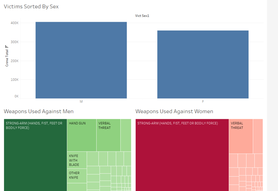
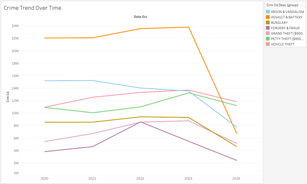
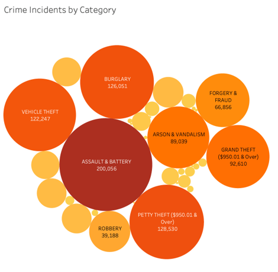

# 🕵️‍♀️ Crime Data Analysis – Los Angeles (2020 to Present)

This project explores and analyzes crime trends across Los Angeles using data published by the LAPD. It includes data cleaning, preprocessing, visualization in Tableau, and insights generation to help government bodies and the public better understand criminal patterns.

---

## 📁 Project Structure

```
📦 Crime-Data-Analysis/
├── 📒 Crime Data Analysis.ipynb         # Main Jupyter Notebook
├── 📄 crime_data_sample.csv             # Small sample dataset (1,000 rows)
├── 📄 LAPD_Crime_Dashboard.twbx         # Tableau dashboard file
└── 📄 README.md                         # Project documentation
```

---

## 📊 Dataset Source

- Full Dataset (not hosted in repo due to size):  
  🔗 [Crime Data from 2020 to Present – Data.gov](https://catalog.data.gov/dataset/crime-data-from-2020-to-present)

- Published by: Los Angeles Police Department (LAPD)  
- Features: ~1 million records, 28 columns, covering crime type, time, location, victim demographics, and weapons used.

---
## 🔗 Large Dataset Downloads

Due to GitHub’s file size limits, large datasets used for this project are hosted externally:

- [Download Full Dataset (CSV)](https://drive.google.com/file/d/1PIJ_RnvUV77WFqUuUg_RPOEJfw9mcWrx/view?usp=sharing)
- [Download Cleaned Dataset (CSV)](https://drive.google.com/file/d/1Zuk4Yl3SE8YYo_cYw7L47GwGbdRNlt7R/view?usp=sharing)

## 🎯 Project Objective

The purpose of this project is to identify crime patterns that can inform law enforcement strategies, urban planning, and public awareness. We focused on:
- Frequent crime types
- High-crime geographic areas
- Victim demographics
- Time-based crime trends

---

## 🧹 Data Cleaning & Preprocessing

- Handled missing values
- Removed duplicates
- Standardized formats (time, dates, category labels)
- Created a cleaned and structured dataset for analysis

---

## 📊 Visual Insights (Tableau & Python)

Here are a few of the visualizations used in our analysis:

### 🔫 Weapons Used by Gender


### 🕒 Crime by Hour of Day


### 🌍 Top Crime Categories


You can explore the full dashboard on Tableau Public or with the provided `.twbx` file.

---

## 🔍 Summary of Findings

- **Women** were more frequently victims of bodily force than men.
- **2024 saw a decrease** in overall crime compared to 2020–2023.
- **Central Area** had the most criminal activity overall.
- **77th Street Division** reported the highest number of violent and firearm-related crimes.
- **Most crimes occur around noon**, although this could be skewed by how time was recorded.

---

## 🔮 Future Scope

- The LAPD dataset is **updated daily**.  
  We propose creating an **automated ETL pipeline** using tools like **Apache Airflow**, **AWS Lambda**, or **Cloud Functions** to:
  - Fetch the latest data daily from data.gov
  - Clean and preprocess it
  - Update a **live Tableau or Power BI dashboard**

- Potential to integrate **machine learning models** to:
  - Predict high-risk crime hours and locations
  - Identify seasonal or demographic crime trends
  - Offer proactive insights to city officials and law enforcement

- Incorporate data from **previous decades** to compare trends over a longer timeline.

---

## 🛠️ Tools and Technologies

- **Languages:** Python (Pandas, NumPy, Matplotlib, Seaborn)
- **Visualization:** Tableau
- **Environment:** Jupyter Notebook
- **Data Source:** LAPD via data.gov

---

## 📧 Contact

Made with 💻 by [Harshada Jadhav](https://www.linkedin.com/in/harshada-jadhav/)
